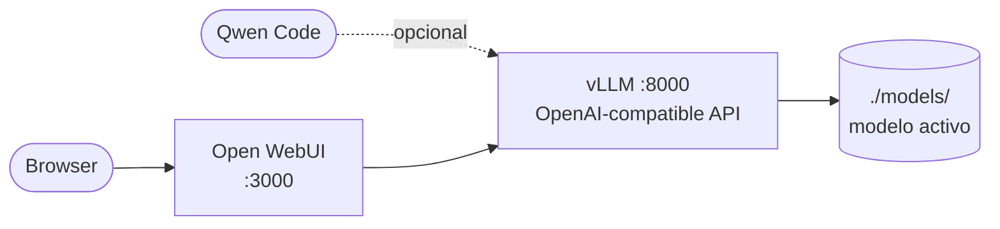

# Local LLM

> Offline GPU LLM stack

Este proyecto contiene scrips de instalación y configuración de un entorno de
ejecución LLM open source.

## Arquitectura


Tiene soporte para varios modelos, pero sólo úno funciona por vez, para lo cual se definen múltiples archivos de perfiles y luego se inician haciendo:

```bash
./scripts/run.sh <profile>
```

Esto levanta al modelo utilizando `vLLM` y exponiendo un API estilo OpenAI en el puerto 8000. Además, expone una interfaz Web en el puerto 3000 mediante `Open WebUI`



## Project layout

```
local-llm/
├── docs/HARDWARE.md        RAM / VRAM / CPU / card requirements per model
├── docker-compose.yml      vLLM + Open WebUI, fully parameterized (no need to edit)
├── config.env              shared settings: API key, ports, Open WebUI version
├── profiles/               one .env per model (repo, folder, vLLM version, flags)
├── scripts/prepare.sh      ONLINE: download weights + embedding model, pull images
├── scripts/run.sh          OFFLINE: start / switch / stop / logs / status
└── models/                 weights (filled by prepare.sh), mounted read-only
```

## Profiles

| Profile                 | Model                        | Min VRAM | Notes                                    |
|-------------------------|------------------------------|----------|------------------------------------------|
| `qwen3.8-27b-fp8`       | Qwen3.8-27B (official FP8)   | 48 GB    | Use with Ada/Hopper 48 GB                |
| `qwen3.8-27b-nvfp4`     | Qwen3.8-27B (NVFP4)          | 32 GB    | Use with Blackwell only, longest context |
| `qwen3.8-27b-gptq-int4` | Qwen3.8-27B (community int4) | 24 GB    | Use with Ampere and 24-32 GB cards       |
| `qwen3.6-35b-a3b-fp8`   | Qwen3.6-35B-A3B (MoE)        | 48 GB    | Fastest generation                       |
| `qwen2.5-0.5b-cpu`      | Qwen2.5-0.5B Instruct        | -        | Solo CPU, para pruebas                   |
| `olmo3-7b-fp8-16gb`     | Olmo 3 7B Instruct           | 16 GB    | Fully open model                         |
| `olmo3-7b-4bit-8gb`     | Olmo 3 7B Instruct           | 8 GB     | Use with RTX 4060-class, short context   |
| `smollm2-135m-cpu`      | SmolLM2-135M Instruct        | -        | solo CPU, para pruebas                   |

Full details (RAM, CPU, disk, smallest NVIDIA card, GPU generations): **[docs/HARDWARE.md](docs/HARDWARE.md)**.

## Host requirements

NVIDIA driver, Docker with the Compose plugin (v2.17+ for multiple `--env-file`), and the
NVIDIA Container Toolkit. Linux recommended; Windows works via Docker Desktop + WSL2.

## Uso paso a paso

### 1. Configurar claves

Editá el archivo `config.env` y actualizá los valores de `VLLM_API_KEY` y `WEBUI_SECRET_KEY`.

### 2. Preparar entorno

El siguiente paso es descargar los archivos de pesos y las imágenes docker de `Open WebUI` y `vLLM`:

```bash
# para pruebas sin GPU
./scripts/prepare.sh qwen2.5-0.5b-cpu
./scripts/prepare.sh smollm2-135m-cpu

# para pruebas con GPU
./scripts/prepare.sh qwen3.8-27b-fp8
./scripts/prepare.sh olmo3-7b-fp8-16gb
# o cualquiera de los otros modelos...
```

### 3. Ejecutar el entorno

```bash
./scripts/run.sh qwen3.8-27b-fp8
./scripts/run.sh status
./scripts/run.sh logs
```

Luego navegá a http://localhost:3000 y creá una cuenta. El modelo elegido debería cargar tras algunos segundos o minutos. Otras herramientas pueden llamar programáticamente al modelo accediendo a `http://localhost:8000/v1` con la clave provista en `VLLM_API_KEY` y el modelo `SERVED_MODEL_NAME`.

### 4. Cambiar el modelo

```bash
# esto sólo reinicia a vLLM, no borra al estado de Open WebUI
./scripts/run.sh olmo3-7b-fp8-16gb
./scripts/run.sh status
./scripts/run.sh logs
```

### 4. Detener al modelo

```bash
./scripts/run.sh stop
```

## 5. Opcional: uso con Qwen Code

[Qwen Code](https://github.com/QwenLM/qwen-code) soporta endpoints compatibles con OpenAI.
Para apuntarlo a este stack, configurá:

| Campo      | Valor                                             |
|------------|---------------------------------------------------|
| Base URL   | `http://localhost:8000/v1`                        |
| API key    | el valor de `VLLM_API_KEY` en `config.env`        |
| Model name | el valor de `SERVED_MODEL_NAME` del perfil activo |

Usá cualquiera de los perfiles Qwen; los modelos Olmo no son aptos para programación.

Si necesitás acceso desde otra máquina (por ejemplo, desde el IDE de una notebook),
configurá `VLLM_BIND=0.0.0.0` en `config.env`.

## Adding a new model

Copy a profile and change `HF_REPO`, `MODEL_DIR`, `SERVED_MODEL_NAME`; set `VLLM_TAG` to the
version the model card recommends and copy its parser flags (`--reasoning-parser`,
`--tool-call-parser`, `--trust-remote-code`). Size it with the formula at the end of
docs/HARDWARE.md. Then `./scripts/prepare.sh <new>` and `./scripts/run.sh <new>`.

## Memory tuning

vLLM reserves `MODEL_MEMORY_UTILIZATION` x VRAM at startup: weights first, the rest is KV cache.
En el perfil CPU (`vllm/vllm-openai-cpu`) la misma variable controla fracción de RAM del sistema en lugar de VRAM.
On OOM or "not enough KV cache", adjust the profile in this order:

1. lower `MAX_MODEL_LEN` (e.g. 65536 -> 32768)
2. lower `MAX_NUM_SEQS` (concurrent requests)
3. add `--kv-cache-dtype fp8` (Ada/Hopper/Blackwell)
4. add `--enforce-eager` (saves ~0.5-1 GB, slightly slower)
5. switch to a smaller quantization profile

Para distribuir el modelo en múltiples GPUs, configurá `TENSOR_PARALLEL_SIZE=N` en `config.env`.

## Offline hardening (already configured)

- vLLM: `HF_HUB_OFFLINE`, `TRANSFORMERS_OFFLINE`, usage stats off; model loaded from a local path.
- Open WebUI: `OFFLINE_MODE`, web search off, Ollama off, telemetry off, RAG embedding model
  loaded from `models/_embeddings` (downloaded by prepare.sh).

## Troubleshooting

- **vLLM tries to reach huggingface.co**: the model folder is missing `config.json`; re-run prepare.
- **Open WebUI shows no model**: vLLM is still loading (`./scripts/run.sh logs`) or the API keys
  don't match. Esperá unos segundos y recargará la página.
- **Errors after changing `VLLM_TAG`**: pin it back to the version from the model card.

## Tareas futuras

1. Relajar el modo offline para que pueda acceder a la web
2. Probar integración con herramientas externas
3. Depurar el listado de modelos de Qwen.
